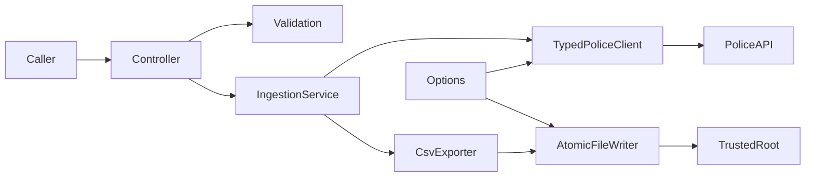

# Architecture

## Inspected baseline

Repository root contains Test Proj.slnx, .gitignore and the Test Proj directory. The application project is Test Proj/Test Proj.csproj, target net10.0, RootNamespace Test_Proj, nullable and implicit usings enabled, Microsoft.AspNetCore.OpenApi 10.0.12. Preserve these names and version unless a justified later dependency change is required. Working product name does not mandate a rename.

Program.cs registers controllers/OpenAPI, redirects HTTPS, uses authorization middleware and maps controllers. OpenAPI is Development-only. Stage 1 inserts Development-only local JSON after standard JSON and before higher-priority providers, before registration/build. Local JSON reload is disabled; options changes require restart. The unused GitHub placeholder has been removed, and local JSON is excluded from build/publish output. WeatherForecast model/controller and the .http example are template code; remove/update when the first real route arrives in Stage 4. Local settings are already ignored and untracked.

Baseline inspection: clean main at 55f0bb2; SDK 10.0.401; application build --no-restore passed, zero warnings/errors. No tests or ingestion code at baseline; Stage 1 adds the foundation suite.

## Proposed layout

Retain one application. Add one necessary test project at tests/PoliceDataIngestion.Api.Tests/PoliceDataIngestion.Api.Tests.csproj (net10.0, xUnit) to the EXISTING solution in Stage 1. Keeping tests outside the application avoids default SDK compile globs. No domain/infrastructure projects or generic repository layer.

Under Test Proj/, namespaces remain Test_Proj plus folder names:

| Directory | Responsibility |
| --- | --- |
| Controllers | HTTP binding, service call, documented responses |
| Contracts/Requests and Responses | Validated requests and safe result metadata |
| Clients/PoliceApi and Contracts | Typed client, upstream DTOs, transient transport policy |
| Services | Dataset ingestion and explicit DTO-to-row mapping |
| Export | CSV encoding, safe filenames, atomic file writer and operation lease |
| Options | PoliceApiOptions, ExportOptions and startup validation |
| Validation | Reusable coordinate/month rules |
| Errors | Typed failure categories and centralized ProblemDetails translation |

Avoid abstractions that only mirror a concrete class. Interfaces at replaceable HTTP/export/service boundaries support genuine unit isolation. Application services validate defensively before obtaining the operation lease, fetching, mapping and exporting. Dispose leases in finally. Controllers pass RequestAborted through every async boundary.

## Contracts and mapping

Use explicit System.Text.Json property names for upstream snake_case. Upstream DTOs remain separate from exported rows. Ignore unknown properties for forward compatibility; reject missing required identifiers/invalid required shapes instead of silently skipping records. Optional upstream location/outcome/demographics may be null. Dataset stages confirm official examples, freeze fixtures, and document deliberate schema adjustments.

Initial CSV schema/order:

- Forces: id,name. Both required nonblank strings.
- Crimes: id,persistent_id,category,month,latitude,longitude,street_id,street_name,location_type,context,outcome_category,outcome_date. id/category/month required; location and outcome optional; requested month is validated against returned month when present.
- StopSearches: type,datetime,age_range,gender,self_defined_ethnicity,officer_defined_ethnicity,legislation,object_of_search,outcome,involved_person,operation,operation_name,latitude,longitude,street_id,street_name. type/datetime required; optional fields empty, nullable booleans lowercase true/false or empty. No fabricated identifier.

Use invariant culture; preserve upstream timestamp offsets as ISO 8601; never guess local timezone. Nested location/street/outcome objects flatten explicitly. Export no raw JSON blobs.

## Transport and configuration

PoliceApiOptions: BaseUrl (default https://data.police.uk/api/), attempt timeout, total operation timeout, maximum attempts, body/record limits. Enforce exact production HTTPS origin data.police.uk, default port, no userinfo, query or fragment; relative paths are code-owned. Test substitution uses a fake handler, not an arbitrary network destination. Disable redirects. Retry and error mapping follow R8-R11, with one retry owner and injected TimeProvider/delay/random seam for deterministic tests.

ExportOptions: OutputRoot and conservative resource bounds in R7. The trusted configured root is normalized once; Development may resolve Environment.SpecialFolder.DesktopDirectory plus PoliceDataIngestion. Outside Development require explicit root. Startup rejects unsupported configuration, unavailable Desktop fallback, filesystem roots, traversal, Windows device names, non-fixed Windows drives and existing link/file components. Explicit directories may not yet exist; permissions and filesystem race checks are the Stage 3 writer responsibility and must also be checked at write time. Use a bounded single global lease (singleton) with immediate contention failure. File safety follows R15-R17; shared roots across multiple processes are unsupported.

Register options with startup validation, typed client via AddHttpClient, application services via DI, singleton lease and clock. Avoid introducing resilience packages by default; a small bounded client policy is sufficient if thoroughly tested.

Stage 2 implements the typed forces client and a reusable bounded array reader. The reader buffers at most the configured body bytes before parsing a JSON document, checks array length before materializing DTOs, and checks cancellation while reading and mapping. Memory remains proportional to the bounded body plus allowed records; it is not an unbounded streaming ingestion pipeline. Only HTTP 200 arrays succeed. Default HttpClient URL loggers are removed in favor of safe structured transport events. The production handler disables redirects, cookies and decompression and bounds response headers at 32 KiB. Options are snapshotted after validation in the client. Request values are immutable validated LocationMonth instances; future dataset methods retain code-owned paths.

TimeProvider supplies deadline timers, monotonic elapsed time, HTTP-date interpretation and cancellable retry delays; IRetryJitter supplies only the bounded random fraction. Ordinary backoff is 500 ms times powers of two plus 0..250 ms, capped at 5 seconds. Retry-After is a minimum, so the chosen delay is the greater of valid Retry-After and normal backoff; an unfittable delay fails with a safe 503 category. Transient network classifications are Unknown, NameResolutionError, ConnectionError and ResponseEnded (plus body I/O failures); certificate/authentication/protocol/configuration failures are not retried. Attempt timeouts may retry inside the total retrieval budget; caller cancellation never retries. The future operation-level deadline in Stage 7 must also encompass file I/O.

## Errors, logging and hosting

Central exception handling maps known errors to ProblemDetails with stable codes/statuses. Validation errors use ValidationProblemDetails. Production and Development ingestion error bodies must both be sanitized. Internal logs use approved safe fields, not exception strings containing local paths or payloads. No silent exception swallowing; cleanup failures are recorded safely without replacing the primary failure.

A successful HTTP response represents an already-published CSV, not a queued job. No transaction across datasets. No automatic /run endpoint. OpenAPI describes all three POSTs, validation, success and error schemas. Unit tests cover individual components; WebApplicationFactory integration tests use the same test project and a partial Program entry point when needed in Stage 8. They substitute all upstream calls and write only to temporary roots.
